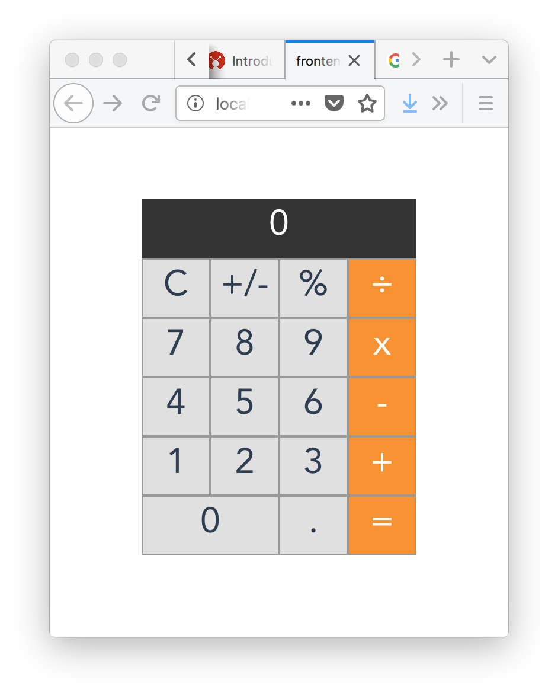

# Calculator written in Vue

> Dirty clone of macos calculator

## Build Setup

``` bash
cd frontend

# install dependencies
npm install

# serve with hot reload at localhost:8080
npm run dev

# build for production with minification
npm run build

# build for production and view the bundle analyzer report
npm run build --report
```

## Original


## Clone

